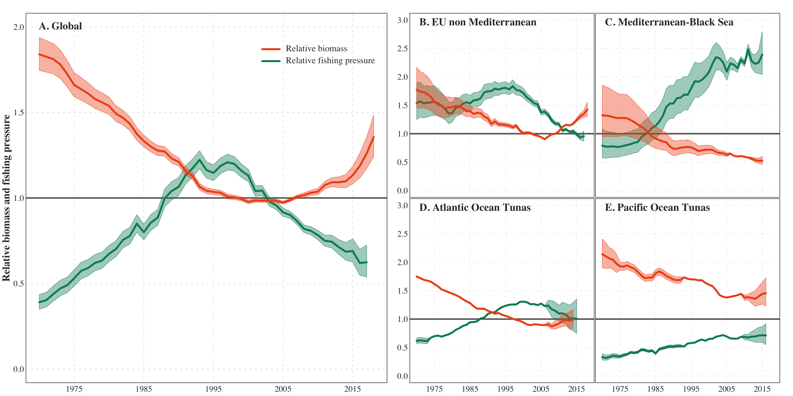

# IPBES Sustainable Use Assessment - Figure Chap3 Global Fish Stocks

This repository contains the code to reproduce the Figure 'Global Fish Stock' of 
the chapter 3 of the **IPBES Sustainable Use Assessment**. This figure shows the 
evolution of the estimated abundance of global fish stocks.

## Usage

First clone this repository, then open the R script `make.R` and run it.
This script will read data stored in the folder `data/` and export the figure
in the folder `figures/`.

## License

This work is licensed under 
[Creative Commons Attribution-NonCommercial-NoDerivatives 4.0 International](https://creativecommons.org/licenses/by-nc-nd/2.0/).

Please cite this work as: [...]

